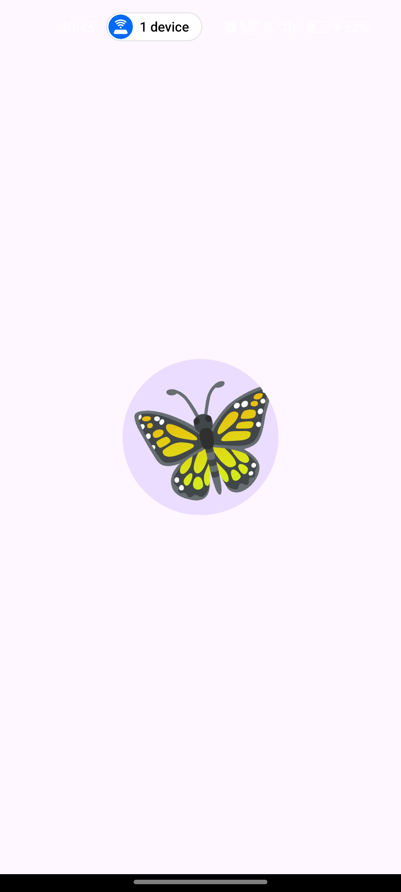
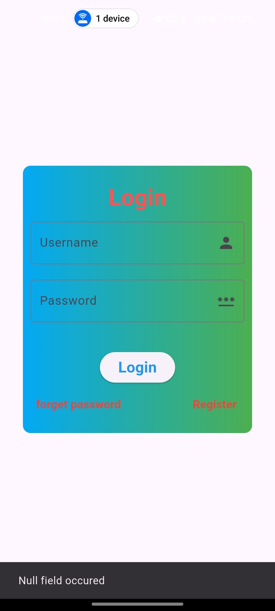
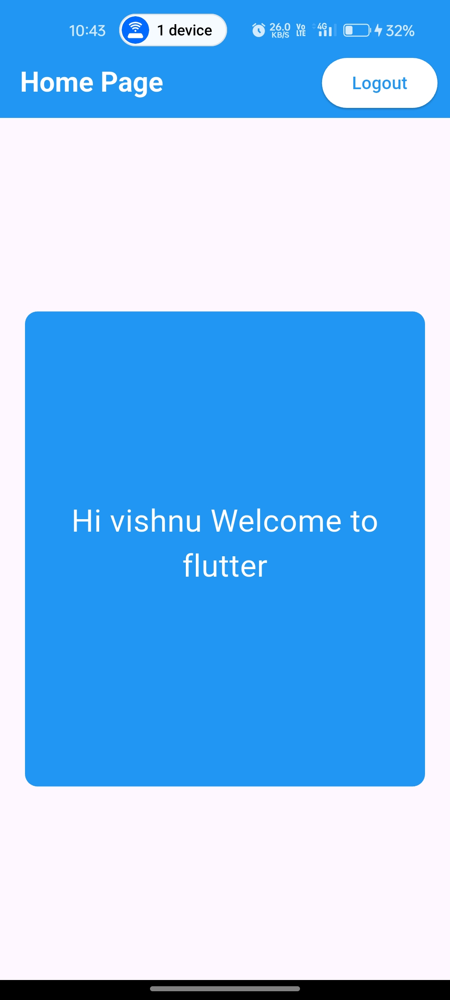

# Flutter Login App

A simple Flutter application that demonstrates a splash screen, login form validation, and shared preference-based session handling.

---

## 🚀 Features

- ✨ Splash Screen with animated GIF
- 🔐 Login Page with validation (checks for empty fields)
- 💾 Shared Preferences to store and retrieve username
- 📱 Dynamic Home Screen with personalized welcome message
- 🔁 Logout button that clears session and returns to splash

---

## 📸 Screenshots

### 🔹 Splash Screen

### 🔹 Login Page

### 🔹 Home Page

---

## 📂 Folder Structure

lib/
├── main.dart
├── splashScreen.dart
├── login.dart
└── homepage.dart

assets/
└── images/
    └── Butterfly.gif

screenshots/
├── splashscreen.jpg
├── login.jpg
└── homepage.jpg

